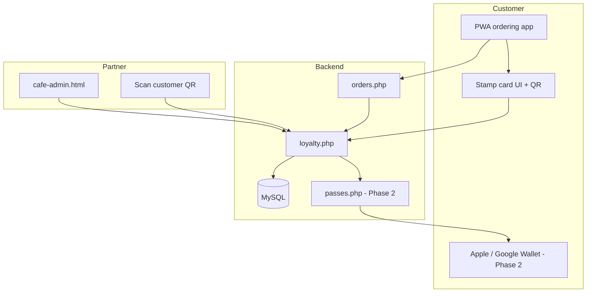

# Workplace Roast

**Your neighbourhood coffee platform** — a hyper-local digital commerce experience that connects local cafes and businesses with nearby offices, workplaces, and residential communities.

## Site

- **Marketing site:** [`index.html`](index.html) — features, pricing, FAQ, contact
- **Partner portal:** [`partner.html`](partner.html) — sign in (redirect to dashboard) and partner account requests
- **Live site:** [workplaceroast.com](https://workplaceroast.com)

## Partner dashboard (app)

Partners manage their venue in the separate PWA at [workplaceroast.com/pwa/](https://workplaceroast.com/pwa/).

## This repository

Static HTML, CSS, and JavaScript. Contact and account-request forms submit via [Web3Forms](https://web3forms.com/). For setup, structure, and customization details, see [`README.md`](README.md).

---

## Digital stamp loyalty system (planning notes)

*Saved from planning conversation — July 2026.*

### Decision

Do **not** integrate [Highlightcards](https://highlightcards.com/) as a third-party platform. Build a native digital stamp system inside Workplace Roast instead — same customer outcome (repeat visits, rewards, wallet-style experience) but owned end-to-end.

Highlightcards was reviewed as a reference for features only:

| Highlightcards feature | Workplace Roast equivalent |
|------------------------|----------------------------|
| Stamp / reward cards | Custom loyalty engine in MySQL + PWA UI |
| QR signup at counter | Printable QR → PWA join flow |
| Scanner app for staff | QR scan in `cafe-admin.html` (already have `html5-qrcode`) |
| Apple / Google Wallet | Phase 2 — generate passes from our backend |
| Push notifications | Phase 3 — wallet pass updates or web push |

---

### Architecture overview



**Identity key:** `(corporate_client_id, customer_email)` — stamps scoped per cafe tenant.

**Primary integration hook:** after successful Stripe payment, `orders.php` awards a stamp and returns `{ stamps, stampsUntilReward, rewardReady }` to the PWA (`sendOrderToBackend()` in `pwa/index.html`).

---

### Database (new tables)

```sql
loyalty_programs
  - corporate_client_id
  - stamps_required          -- e.g. 9
  - reward_description       -- e.g. "Free regular coffee"
  - enabled

loyalty_accounts
  - corporate_client_id
  - email
  - name
  - stamp_count                -- current cycle
  - lifetime_stamps
  - card_token                 -- unique QR identifier (UUID)
  - created_at

loyalty_transactions
  - account_id
  - type                       -- earn | redeem | adjust
  - stamps_delta
  - order_id                   -- nullable
  - created_by                 -- system | staff
  - created_at
```

---

### API endpoints (to build)

| Endpoint | Purpose |
|----------|---------|
| `GET /loyalty.php?email=&cafe_id=` | Current stamp balance |
| `POST /loyalty/join.php` | Opt in with email → create account + QR token |
| `POST /loyalty/redeem.php` | Staff redeems reward (auth required) |
| Hook in `orders.php` | +1 stamp on paid order |

---

### Rollout phases

#### Phase 1 — In-app stamp card (MVP)

No Apple/Google wallet yet. ~80% of value.

- **PWA:** “Join loyalty” at checkout; stamp card UI on menu; post-checkout “You earned 1 stamp” message; customer QR for staff
- **Cafe admin:** toggle program, set stamps required + reward text, scan QR to add stamp / redeem, view activity
- **Rules:** 1 stamp per qualifying order; reset on redeem; optional — only award when cafe marks order **complete** (fraud prevention)

#### Phase 2 — Apple Wallet + Google Wallet

Pass display only; stamp logic stays in our backend.

| Platform | Requirements |
|----------|--------------|
| Apple Wallet | Apple Developer account, Pass Type ID, signing certificate, web service URL for updates |
| Google Wallet | Google Cloud project, Wallet API, service account, issuer ID |

Flow: join → generate `.pkpass` (Apple) + save URL (Google) → on earn/redeem push update to installed passes.

Pass generation can be self-hosted (PHP + certificates) or via a pass infrastructure API (WalletPass API, Passlet, etc.) — still our data and rules.

#### Phase 3 — Extra features

- Printable signup QR at counter (like existing `pwa/generate-qr-codes.html`)
- Push / geo notifications via wallet passes
- Referral codes (+1 stamp when friend’s first order completes)
- Double stamps (time rules, e.g. before 10am)
- Birthday offers (cron + email)

---

### Existing codebase integration points

| Area | File | Notes |
|------|------|-------|
| Order + payment hook | `pwa/index.html` → `sendOrderToBackend()` | POST to `orders.php` after Stripe success |
| Tenant scoping | `pwa/config.js` | `corporate_client_id` from URL / access code |
| Customer identity | Checkout fields `#customerEmail`, `#customerName` | No accounts today — email is loyalty key |
| QR scanning | `pwa/index.html` (`html5-qrcode`) | Currently chair selection only — reuse for loyalty |
| QR generator | `pwa/generate-qr-codes.html` | Template for counter signup QRs |
| Partner admin | `pwa/cafe-admin.html` | Add loyalty config + scanner |
| Backend | `pwa/api/` | Most PHP not in repo; needs deploy before loyalty |

---

### Prerequisites before building

1. **Deploy full PHP API** — `orders.php`, `config.php`, etc. (referenced by frontend but largely missing from repo)
2. **Fix cafe ID mismatch** — `config.js` maps Law Firm to ID `2`, DB export has ID `3`
3. **Require email for loyalty** — keep optional for guest checkout, required to join program
4. **Wire admin orders to backend** — today `admin.html` / `cafe-admin.html` use localStorage, not `orders` table

---

### Effort estimate

| Phase | Scope | Effort |
|-------|--------|--------|
| 1 | DB + `loyalty.php` + in-app stamp card + post-order earn | ~1–2 weeks |
| 2 | Staff scanner in cafe-admin + redeem flow | ~3–5 days |
| 3 | Apple + Google Wallet passes | ~2–4 weeks |
| 4 | Push, referrals, promos | As needed |

---

### Next implementation slice (when ready)

1. SQL migration for loyalty tables
2. `pwa/api/loyalty.php` (join, balance, earn, redeem)
3. Stamp card component in `pwa/index.html`
4. Loyalty section in `pwa/cafe-admin.html`

**Open choice:** Phase 1 only (in-app) vs Phase 1 + wallet from the start.

---

© Workplace Roast
